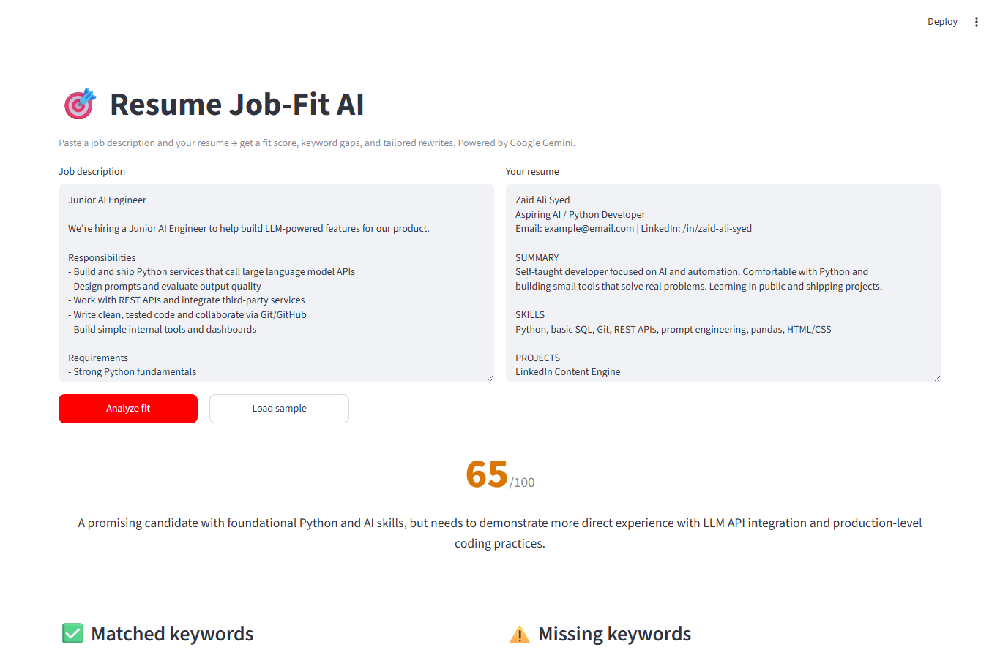

# Resume Job-Fit AI

Paste a **job description** and your **resume** (or upload a PDF) → get an instant **fit score (0–100)**, the **keywords you're missing**, **AI-rewritten resume bullets**, a **tailored cover letter**, **interview prep**, a **skills gap roadmap**, and a **LinkedIn profile optimizer** — all in one click.

Built to answer a real question every applicant has: *"How well does my resume actually match this job — and what do I do about it?"*

**🔗 [Try it live → resume-job-fit-ai.streamlit.app](https://resume-job-fit-ai.streamlit.app)**

[](https://resume-job-fit-ai.streamlit.app)
[](https://github.com/syzayd/resume-job-fit-ai/actions/workflows/ci.yml)



---

## What it does

| Feature | Details |
|---|---|
| **Fit score (0–100)** | Honest one-line verdict on how well you match |
| **Matched / missing keywords** | Color-coded chips showing exactly which skills to surface |
| **Tailored bullet rewrites** | Your real bullets, rewritten for impact and keyword alignment — never fabricated |
| **ATS tips** | Concrete phrases to add so applicant-tracking systems don't filter you out |
| **Cover letter** | Three-paragraph, role-specific draft grounded in your actual resume — copyable in one click |
| **Interview prep** | 5–7 tailored questions with why-asked context and tips from your real background |
| **Skills gap roadmap** | Prioritized gaps (High / Medium / Low), named courses + providers, quick wins this week |
| **LinkedIn optimizer** | AI-generated headline, About section, skills to add, and profile tips — all role-specific and copyable |
| **Generate all sections ✨** | One button to generate every AI section at once — no tab-by-tab clicking |
| **Multi-job comparison** | Paste 2–3 job descriptions — get a ranked table of which role fits best, strengths vs gaps per job, and a suggested apply order |
| **PDF upload** | Upload your resume PDF — text is extracted automatically |
| **Download (.txt / .docx)** | Export everything as plain text or a formatted Word document |
| **Job Application Tracker** | Save any analysis to a local SQLite DB — track status (Applied/Interviewing/Offer/Rejected), add notes, see stats, export CSV |

---

## Tech

- **Google Gemini** (free tier, no credit card needed) via the official `google-genai` Python SDK
- **Model:** `gemini-2.5-flash-lite` — the most reliable free-tier model (overridable via `GEMINI_MODEL` env var)
- **Structured outputs** — Pydantic schemas passed as Gemini's `response_schema`; the model returns clean, validated JSON every time
- **Streamlit** front end — deployed free on [Streamlit Community Cloud](https://streamlit.io/cloud)
- **pdfplumber** for PDF text extraction
- **XSS prevention** — all Gemini-generated strings are passed through `html.escape()` before rendering with `unsafe_allow_html`
- **Auto-retry** — exponential backoff on transient 429 rate-limits and 5xx server errors (up to 3 attempts)
- Defensive error handling: missing/invalid key, rate limits, oversized input, malformed responses all show friendly messages

---

## Run it in 60 seconds

```bash
git clone https://github.com/syzayd/resume-job-fit-ai.git
cd resume-job-fit-ai

python -m venv venv
venv\Scripts\activate            # Windows
# source venv/bin/activate       # macOS / Linux

pip install -r requirements.txt

cp .env.example .env             # paste your FREE key from aistudio.google.com/apikey
streamlit run app.py
```

Then click **Load sample → Analyze fit → Generate all sections ✨** to see everything work instantly.

---

## Deploy to Streamlit Community Cloud (free)

1. Fork this repo on GitHub.
2. Go to [share.streamlit.io](https://share.streamlit.io) → **New app** → select your fork → `app.py`.
3. Under **Advanced settings → Secrets**, paste:
   ```toml
   GEMINI_API_KEY = "your-key-here"
   ```
   Get a free key (no credit card) at [aistudio.google.com/apikey](https://aistudio.google.com/apikey).
4. Click **Deploy**. Live in ~60 seconds.

---

## Project structure

```
resume-job-fit-ai/
├── app.py                        # Streamlit UI — 5 tabs, Generate All, PDF upload
├── analyzer.py                   # All Gemini logic — schemas, prompts, retry, error handling
├── requirements.txt
├── .env.example                  # GEMINI_API_KEY=your-key-here  (never commit .env)
├── .gitignore
├── README.md
├── .streamlit/
│   ├── config.toml               # Theme + server settings
│   └── secrets.toml.example      # Format for Streamlit Cloud secrets
├── .github/workflows/ci.yml      # GitHub Actions CI (pytest on every push)
├── pages/
│   ├── 1_Compare_Jobs.py         # Multi-job comparison page
│   └── 2_Job_Tracker.py          # Application tracker page
├── tests/
│   └── test_analyzer.py          # 26 unit tests (Gemini mocked)
├── db.py                         # SQLite persistence layer
├── docs/
│   └── screenshot.png
├── logs/                         # Build logs per path
├── sample/
│   ├── sample_resume.txt
│   └── sample_job.txt
└── handoffs/                     # Session handoff documents
```

---

## What I learned building this

**Structured outputs are a multiplier.** Passing a Pydantic schema as Gemini's `response_schema` turns the model from "hope it returns valid JSON" into a reliable typed component. No brittle string parsing — the SDK validates the response against the schema on every call.

**Prompt design matters more than model size.** The single most impactful instruction was *"never invent experience the candidate doesn't have."* It's one sentence, but it's what makes the rewrites actually trustworthy and usable. Quality of instruction beats size of model.

**Good error handling is a feature.** Most of the polish was making every failure surface as a friendly, actionable message — bad API key, rate limit, empty input, oversized input, PDF parse failure — instead of a stack trace. Users see this first, not the happy path.

**Free-tier quirks are real constraints.** `gemini-2.0-flash` has 0 free-tier quota right now. `gemini-2.5-flash` 503s under load. `gemini-2.5-flash-lite` is the actual reliable free-tier choice — you only know this by hitting failures in production.

**Streamlit secrets ≠ env vars on Cloud.** Streamlit Community Cloud injects secrets via `st.secrets`, not `os.environ`. A one-time shim at app startup (`os.environ[k] = st.secrets[k]`) bridges the gap cleanly without coupling the core logic to Streamlit.

**Streamlit session state needs intentional keying.** Streamlit reruns the entire script on every widget interaction. Without tracking `pdf_name` in `st.session_state`, the app re-extracted the PDF on every keypress. One extra state key eliminated the problem entirely.

**`-> NoReturn` is not optional for always-raise functions.** If a function always raises, annotating it `-> None` breaks type checker flow analysis — callers after `_handle_api_error(exc)` appear reachable. `-> NoReturn` + `raise _handle_api_error(exc)` at the call site is the correct pattern.

---

## Roadmap

- [x] PDF resume upload
- [x] Cover letter generator
- [x] Interview prep tab
- [x] Skills gap roadmap
- [x] LinkedIn profile optimizer (headline + About + skills)
- [x] Copy-to-clipboard for cover letter and interview answers
- [x] "Generate all sections" one-click button
- [x] Streamlit Community Cloud deploy support
- [x] Multi-job comparison (rank 2–3 jobs against your resume)
- [x] DOCX export (formatted Word document)
- [x] Tests + GitHub Actions CI
- [x] Job application tracker (SQLite — save, track status, export CSV)
- [ ] Update demo screenshot (screenshot predates multi-page UI)

---

*Built in public by **Zaid Ali Syed** · [github.com/syzayd](https://github.com/syzayd)*
*Rewrites stay truthful to your resume — review before using.*
